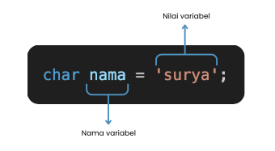

# **Variabel dan Tipe Data dalam Pemrograman C**

---

Di bab ini, kita akan bahas tentang **variabel** dan **tipe data** dalam bahasa C, dua konsep yang jadi dasar banget dalam pemrograman. Kalo kamu bingung tentang apa itu variabel dan tipe data, jangan khawatir! Kami akan jelaskan dengan cara yang simpel dan seru. 

### Apa itu Variabel?

Bayangkan variabel itu kayak **tempat penyimpanan** di dalam komputer yang punya nama dan jenis tertentu. Di dalam bahasa C, kita pakai variabel buat menyimpan nilai yang nanti akan kita pakai atau manipulasi dalam program. Jadi, variabel itu semacam "wadah" tempat kita meletakkan data.

Setiap variabel punya dua komponen penting:

- **Tipe Data**: Ini yang ngatur apa sih jenis data yang bisa disimpan dalam variabel tersebut (misalnya angka bulat, angka desimal, atau karakter).
- **Nama**: Nama ini yang nantinya kamu pakai untuk ngakses variabel tersebut dalam kode.

### Aturan Penamaan Variabel

Nah, supaya kode kita gampang dibaca dan gak error, ada beberapa **aturan** yang harus kamu tahu dalam menamai variabel. Ini dia aturan-aturan penting dalam menamai variabel di bahasa C:

| **Aturan**                                                                | **Penjelasan**                                                                                       | **Contoh Benar**              | **Contoh Salah**           |
| ------------------------------------------------------------------------- | ---------------------------------------------------------------------------------------------------- | ----------------------------- | -------------------------- |
| **1. Nama variabel harus dimulai dengan huruf atau garis bawah (`_`)**    | Nama variabel **tidak boleh dimulai dengan angka**.                                                  | `angka1;`, `_pi;`             | `1angka;`, `3.14;`         |
| **2. Nama variabel hanya boleh mengandung huruf, angka, dan garis bawah** | Karakter selain huruf, angka, dan garis bawah gak boleh digunakan.                                    | `variabel1;`, `huruf_;`       | `variabel#1;`, `$pi;`      |
| **3. Nama variabel bersifat case-sensitive**                              | Huruf besar dan kecil dianggap beda, jadi `angka` dan `Angka` itu dua variabel yang berbeda.          | `int angka;`, `int Angka;`    | -                          |
| **4. Nama variabel gak boleh pakai kata kunci (keyword)**                 | Kata kunci itu istilah yang udah punya arti khusus dalam bahasa C (seperti `int`, `return`).         | `int jumlah;`, `float nilai;` | `int return;`, `float if;` |
| **5. Nama variabel sebaiknya deskriptif**                                 | Nama variabel harus jelas, supaya kita tahu itu variabel buat apa.                                   | `int umur;`, `float suhu;`    | `char a;`, `float x;`      |

### Deklarasi Variabel

Sebelum kamu bisa pakai variabel dalam program, kamu perlu **mendeklarasikannya** dulu. Deklarasi itu cara kita memberitahu program jenis data dan nama variabel yang akan dipakai. Berikut contoh deklarasi variabel di bahasa C:

```c
int x;
float pi;
char huruf;
```

Yap, gampang kan? Variabel-variabel ini siap dipakai dalam programmu!

<br></br>

<div style="text-align: center;">
  
</div>

<br></br>

---

### **Tipe Data dalam Bahasa C**

Di C, **tipe data** itu penting banget karena menentukan **jenis data** apa yang bisa disimpan di variabel kita. Misalnya, apakah itu angka bulat, angka desimal, atau karakter. Kalo salah pilih tipe data, bisa-bisa program kamu jadi error atau gak efisien. 

Berikut adalah beberapa **tipe data dasar** yang paling sering kamu pakai di bahasa C:

| **Tipe Data** | **Deskripsi**                                                                                                                                    | **Contoh Penggunaan**         |
| ------------- | -------------------------------------------------------------------------------------------------------------------------------------------------- | ----------------------------- |
| **`int`**     | Untuk menyimpan **bilangan bulat** (integer), baik positif maupun negatif.                                                                       | `int umur = 20;`              |
| **`float`**   | Untuk menyimpan **angka desimal** (floating point) dengan presisi sedang.                                                                         | `float pi = 3.14;`            |
| **`double`**  | Mirip dengan `float`, tapi **presisi lebih tinggi**. Cocok buat angka desimal yang butuh akurasi lebih.                                            | `double phi = 3.1415926535;`  |
| **`char`**    | Untuk menyimpan **karakter tunggal** (misalnya huruf, angka, atau simbol) dalam format ASCII.                                                      | `char huruf = 'A';`           |
| **`long`**    | Untuk menyimpan angka bulat yang lebih besar dari `int`. Biasanya dipakai buat nilai yang lebih besar.                                             | `long populasi = 7000000000;` |
| **`short`**   | Untuk menyimpan angka bulat lebih kecil dari `int`. Biasanya buat nghemat memori.                                                                 | `short jumlah = 10;`          |

---

### Penjelasan Masing-masing Tipe Data:

1. **`int` (Integer)**

   - **Deskripsi**: Tipe data **`int`** dipakai buat menyimpan **bilangan bulat** (integer), bisa positif atau negatif. Paling umum digunakan di pemrograman.
   - **Contoh**:
     ```c
     int umur = 20; // Menyimpan umur
     int saldo = -5000; // Menyimpan saldo negatif
     ```

2. **`float` (Floating Point)**

   - **Deskripsi**: Tipe data **`float`** dipakai buat menyimpan **angka desimal**. Lebih sedikit presisinya daripada **`double`**.
   - **Contoh**:
     ```c
     float pi = 3.14; // Menyimpan nilai pi
     float suhu = 36.5; // Menyimpan suhu tubuh
     ```

3. **`double` (Double Precision Floating Point)**

   - **Deskripsi**: **`double`** dipakai buat menyimpan angka desimal dengan **presisi lebih tinggi** daripada **`float`**. Cocok buat aplikasi yang butuh ketelitian tinggi, misalnya di bidang matematika atau keuangan.
   - **Contoh**:
     ```c
     double phi = 3.1415926535; // Menyimpan nilai pi dengan lebih akurat
     ```

4. **`char` (Character)**

   - **Deskripsi**: Tipe data **`char`** dipakai buat menyimpan **karakter tunggal**, kayak huruf atau simbol.
   - **Contoh**:
     ```c
     char huruf = 'A'; // Menyimpan karakter 'A'
     ```

5. **`long` (Long Integer)**

   - **Deskripsi**: Tipe data **`long`** buat menyimpan angka bulat yang lebih besar daripada **`int`**. Biasanya dipakai buat angka-angka besar, kayak populasi atau ukuran.
   - **Contoh**:
     ```c
     long populasi = 7000000000; // Menyimpan populasi dunia
     ```

6. **`short` (Short Integer)**

   - **Deskripsi**: **`short`** dipakai buat angka bulat yang lebih kecil dari **`int`**, biasanya buat nghemat memori.
   - **Contoh**:
     ```c
     short jumlah = 10; // Menyimpan jumlah yang lebih kecil
     ```

---

### Program 2: Menggunakan Berbagai Tipe Data

Berikut contoh program yang pakai berbagai tipe data yang kita udah bahas:

```c
#include <stdio.h>

int main() {
    // Deklarasi variabel dengan tipe data yang berbeda
    int umur = 20;
    float pi = 3.14;
    char huruf = 'A';
    long populasi = 7000000000;

    // Menampilkan nilai variabel
    printf("Umur: %d\n", umur);           // Menampilkan umur
    printf("Nilai pi: %f\n", pi);         // Menampilkan pi
    printf("Karakter: %c\n", huruf);      // Menampilkan karakter
    printf("Populasi dunia: %ld\n", populasi); // Menampilkan populasi dunia

    return 0;
}
```

---

### Penjelasan Program:

1. **Deklarasi Variabel**:
   - Variabel-variabel dideklarasikan dengan tipe data yang sesuai, seperti **`int`** buat umur, **`float`** buat pi, **`char`** buat huruf, dan **`long`** buat populasi.
2. **Fungsi `printf`**:
   - Kita pakai fungsi **`printf`** buat menampilkan nilai variabel sesuai dengan tipe datanya. Misalnya, **`%d`** buat **`int`**, **`%f`** buat **`float`**, **`%c`** buat **`char`**, dan **`%ld`** buat **`long`**


Dengan begitu, kamu bisa memulai perjalanan pemrograman C dengan memahami konsep dasar ini. Jangan ragu buat eksplorasi lebih lanjut!

--- 

Sekarang kamu sudah memahami dasar-dasar tentang **variabel** dan **tipe data** dalam pemrograman C! Dengan pemahaman ini, kamu sudah punya dasar yang kuat untuk membangun program-program yang lebih kompleks ke depannya. Jangan lupa, proses belajar pemrograman itu butuh waktu dan latihan. Jadi, jangan takut buat bereksperimen dengan kode, coba berbagai tipe data, dan lihat bagaimana semuanya bekerja.

Ingat, setiap kali kamu menulis kode, kamu sedang belajar sesuatu yang baru. Semakin sering kamu berlatih, semakin mahir kamu dalam menguasai bahasa C. Jadi, terus semangat dan jangan berhenti belajar. Pemrograman itu seperti seni—selalu ada cara baru untuk membuatnya lebih baik!

Jangan ragu untuk mencoba contoh kode yang sudah kamu pelajari, dan ciptakan karya-karya menarikmu sendiri. Dunia pemrograman C menunggu untuk kamu jelajahi lebih jauh!
